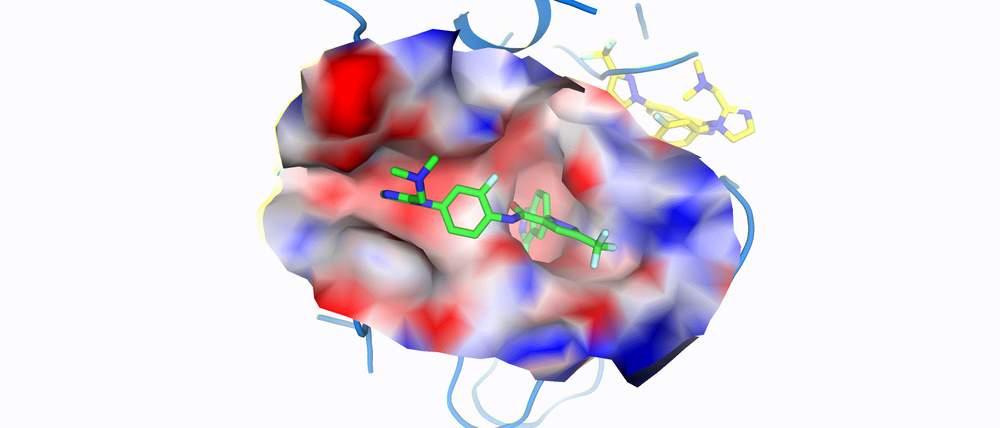

# [SurfDock is a Surface-Informed Diffusion Generative Model for Reliable and Accurate Protein-ligand Complex Prediction](https://doi.org/10.1038/s41592-024-02516-y)


Implementation of SurfDock, by Duanhua Cao & Mingan Chen.

This repository contains all code, instructions and model weights necessary to **Generative Reliable and Accurate Protein-ligand Complex and Screen Compounds** by SurfDock, eval SurfDock or to retrain a new model.
### 🔔 News
***With just a few adjustments to the input files based on your needs, you can seamlessly leverage the advanced diffusion model for structure-based virtual screening!***

1. **We have updated the README file to include instructions for the installation scripts.**

2. **We have added a ***Screen Pipeline*** bash script to assist researchers in directly using SurfDock for virtual screening.(~/SurfDock/bash_scripts/test_scripts/screen_pipeline.sh)**

3. **We have updated the installation instructions for data processing dependencies and provided some compressed files of the already processed installation packages for your convenience**

**More infomations in Section 3**

If you have any question, feel free to open an issue or reach out to us: [caodh@zju.edu.cn](caodh@zju.edu.cn).




## Section 1 : Setup Environment
You can follow the instructions to setup the environment
Our test env Info bellow
```bash
System Info
-----------------------------------------
No LSB modules are available.
Distributor ID: Ubuntu
Description:    Ubuntu 22.04.4 LTS
Release:        22.04
Codename:       jammy
ldd --version
ldd (Ubuntu GLIBC 2.35-0ubuntu3.8) 2.35
-----------------------------------------
GPU Info
NVIDIA-SMI 545.23.06 
Driver Version: 545.23.06
CUDA Version: 12.3
```

**If mamba raise Errors; Please replace it to conda**

**Please select the appropriate version of the software based on your hardware during installation (like pytorch & cuda et.al.)**

```bash
conda create -y -n SurfDock python==3.10
source /opt/conda/bin/activate SurfDock
conda install -y --channel=https://conda.anaconda.org/conda-forge --channel=https://conda.anaconda.org/pytorch --channel=https://conda.anaconda.org/pyg mamba && conda clean -ya
mamba install -y pytorch==2.2.2 pytorch-cuda=12.1 -c pytorch -c nvidia
mamba install -y --channel=https://conda.anaconda.org/conda-forge --channel=https://conda.anaconda.org/pytorch --channel=https://conda.anaconda.org/pyg numpy==1.24.4 scipy==1.8.1 pandas==2.1.2 &&conda clean -ya
mamba install -y --channel=https://conda.anaconda.org/conda-forge --channel=https://conda.anaconda.org/pytorch --channel=https://conda.anaconda.org/pyg openff-toolkit==0.15.2 openmm==8.1.1 openmmforcefields==0.12.0 pdbfixer==1.9 && conda clean -ya
mamba install -y --channel=https://conda.anaconda.org/conda-forge --channel=https://conda.anaconda.org/pytorch --channel=https://conda.anaconda.org/pyg babel==2.13.1 biopandas==0.4.1 openbabel==3.1.1 plyfile==1.0.1 prody==2.4.0 torch-ema==0.3 torchmetrics==1.2.1 && conda clean -ya
mamba install -y pyg -c pyg --freeze-installed
pip install pyg_lib torch_scatter torch_sparse torch_cluster torch_spline_conv -f https://data.pyg.org/whl/torch-2.2.0+cu121.html
pip install -U --no-cache-dir spyrmsd scikit-learn==1.3.2 accelerate==0.15.0 biopython==1.79 e3nn==0.5.1 huggingface-hub==0.17.3 mdanalysis==2.4.0 posebusters==0.2.7 rdkit==2023.3.1 tokenizers==0.13.3 transformers==4.29.2 wandb==0.16.1
pip install pymesh
pip install https://github.com/nuvolos-cloud/PyMesh/releases/download/v0.3.1/pymesh2-0.3.1-cp310-cp310-linux_x86_64.whl
mamba install loguru
pip install dimorphite_dl
pip install prefetch_generator
```

Since we need esm model to get embedding, we need to install esm model before retraining the SurfDock

```bash
git clone https://github.com/facebookresearch/esm 
cd esm 
pip install -e .
```
Since we also need the surface information about the protein 

We need to install APBS-3.0.0, pdb2pqr-2.1.1 on the computer. 
For the convenience of everyone, I packaged the relevant software in APBS_PDB2PQR.tar.gz and put it in the /comp_surface/tools folder. 
```bash
cd ~/SurfDock/comp_surface/tools
tar -zxvf APBS_PDB2PQR.tar.gz
```
Then set the absolute path of msms_bin, apbs_bin, pdb2pqr_bin, and multivalue_bin directly in the ~/comp_surface/prepare_target/default_config/global_vars.py 

**Data processed env dependencies**
```bash
mamba install mx::reduce
mamba install conda-forge::openbabel
```
more information in ~/SurfDock/comp_surface/readme.md

## Section 2 : Dataset

The files in `data` contain the names for the time-based data split on PDBBind.

The data preprocessed by EquiBind group on [zenodo](https://zenodo.org/record/6408497) is no longer available due to PDBBind license.
If you want to train one of our models with PDBBind data, you have to download from the PDBBind website, then process and put it under data/PDBBind_processed

## Section 3 :  We prepared two examples as appetizers for users , users can follow these scripts to use SurfDock as a SBDD Tool.
1. Please setup the env dependencies, then cd ~/bash_scripts/test_scripts
2. Run the eval_sample.sh script and screen_samples.sh for testing

|   Device |   Speed  | Test Samples  | Sampling conformers/molecule | Output conformers/molecule | Sampling steps|
|:----------:|:----------:|:----------:|:----------:|:----------:|:----------:|
|  1*H800  |   ~3.260s/molecule  |   100  |   40  |   1  |   20  |
|  8*H800  |   ~0.414s/molecule  |   800  |   40  |   1  |   20  |
|  1*H800  |   ~3.284s/molecule  |   100  |   40  |   40  |   20  |
|  8*H800  |   ~0.417/molecule  |   800  |   40  |   40  |   20  |

## Section 4 : Running SurfDock on your complexes

In our code directory, we write many bash scripts to help user to run SurfDock ,you just follow the example file to adjust the file path ,and then run the specific bash file !
pleas run:
`cd ~/SurfDock/bash_scripts/test_scripts/`
`bash eval_samples.sh`

#### Tips.1 **if you have some errors about this file ~/yourpath/.../pymesh/lib/libstdc++.so.6，just raname it as libstdc++.so copy.6 or some names like this, since this file not be used in our env**


if you want to use the wandb to record the result ,please set the next parameters:
    --wandb 
    --wandb_key your_wandb_key 
    --wandb_name your_wandb_name 
Finanly, check the result in the relative path (which you can find in the Docking.sh)

## Section 5: Running SurfDock to Screen compund

a sample run:
`cd ~/SurfDock/bash_scripts/test_scripts/`
`bash screen_pipeline.sh`
if you want to use the wandb to record the result ,please set the next parameters:
    --wandb 
    --wandb_key your_wandb_key 
    --wandb_name your_wandb_name 
Finanly, check the result (a csv file include the result DIR) in the out_dir path

## Section 6 : Retraining SurfDock

If you want to retrain your SurfDock, please Download the data and place it as described in the "Dataset" section above.

You can follow the steps in ~/SurfDock/bash_scripts/test_scripts/eval_samples.sh to get surface information.

Then, you can prepare the esm embedding file for the protein by run the next commands:
`cd ~/SurfDock/bash_scripts/train_SurfDock_docking_module`
Make sure you set up all parameter files in the esm_embedding.sh 
` bash esm_embedding.sh`

then 
`cd ~/SurfDock/bash_scripts/train_SurfDock_docking_module`
Make sure you set up all parameter files in the train_SurfDock.sh
` bash train_SurfDock.sh`
if you want to use the wandb to record the result ,please set the next parameters in train_SurfDock.sh:
    --wandb 
    --wandb_key your_wandb_key 
    --wandb_name your_wandb_name 

## Section 7 : Retraining SurfScore

Same as the previous step


## Section 8 : Citation
Please cite the following article if you find our work helpful:

Cao, D., Chen, M., Zhang, R. et al. SurfDock is a surface-informed diffusion generative model for reliable and accurate protein–ligand complex prediction. Nat Methods (2024). 
https://doi.org/10.1038/s41592-024-02516-y


## Section 9 : License

MIT